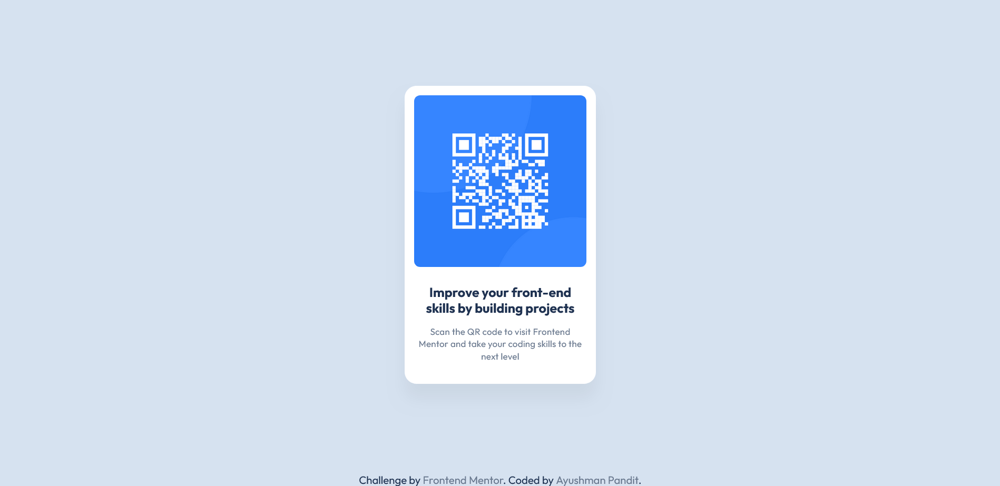

# Frontend Mentor - QR code component solution

This is a solution to the [QR code component challenge on Frontend Mentor](https://www.frontendmentor.io/challenges/qr-code-component-iux_sIO_H). Frontend Mentor challenges help you improve your coding skills by building realistic projects.

## Table of contents

-   [Overview](#overview)
    -   [Screenshot](#screenshot)
    -   [Links](#links)
-   [My process](#my-process)
    -   [Built with](#built-with)
    -   [What I learned](#what-i-learned)
    -   [Continued development](#continued-development)
-   [Author](#author)

## Overview

### Screenshot

### Links

-   Solution URL: (https://github.com/AyushmanPandit/QR-Code-Component)
-   Live Site URL: (https://ayushmanpandit.github.io/QR-Code-Component/)

## My process

-   Reviewed the given preview and design images for desktop and mobile
-   Planned out my actions that were required to build the webpage
-   Wrote the semantic html for the webpage
-   Checked the given figma files and imported the required fonts and colors for the webpage
-   Using the figma designs, styled the elements one by one until satisfied, then moved on to the next
-   Finally, Compared the webpage to the original and made minute changes to make it look as similar to the original as possible

### Built with

-   Semantic HTML5 markup
-   CSS custom properties

### What I learned

Polished my HTML5 and CSS skills further with this project and learned how to write cleaner and more efficient code.

### Continued development

Now that I'm comfortable with basic CSS3, I wish to tackle projects involving heavy use of flexbox and grid to get better at it.

## Author

-   Frontend Mentor - [@AyushmanPandit](https://www.frontendmentor.io/profile/AyushmanPandit)
